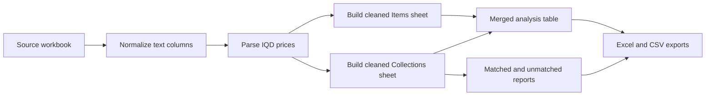

# Venter Analysis Project

A clean, bilingual product-catalog pipeline for vendor exports.

This repository turns a noisy workbook into something that is easier to trust, easier to review, and easier to present on GitHub. It keeps the original exploratory notebook, but the reusable logic now lives in a proper Python package and command-line script.

[](https://www.python.org/)
[](LICENSE)
[](https://pandas.pydata.org/)

## What This Project Does

The Venter Analysis pipeline standardizes bilingual product data, converts prices from IQD to PKR, and produces analysis-ready exports without overwriting the source workbook.

It is built for product catalogs that mix:

- Arabic and English text
- raw vendor naming conventions
- variant labels such as color or size
- currency strings such as `25,000 IQD`

## Why It Is Better Now

The original notebook was useful for exploration, but it was hard to maintain and it overwrote the source workbook. The updated version fixes that by:

- moving the processing rules into reusable Python functions
- adding a command-line entry point
- writing outputs into `outputs/` instead of replacing the input file
- generating a summary sheet and match reports
- adding tests for the reusable pipeline

## Current Data Snapshot

The bundled workbook in `Vender Analysis/Venter_Analysis.xlsx` contains the processed snapshot used for this project.

| Metric | Value |
| --- | ---: |
| Items rows | 24,702 |
| Collections rows | 14,486 |
| Merged rows | 39,188 |
| Matched collection rows | 14,486 |
| Matched collection rate | 100% |
| IQD to PKR conversion rate | 0.2153927 |

## Pipeline Overview



## Repository Structure

```text
.
|-- README.md
|-- LICENSE
|-- requirements.txt
|-- requirements-dev.txt
|-- scripts/
|   `-- process_venter_analysis.py
|-- tests/
|   `-- test_pipeline.py
|-- venter_analysis/
|   |-- __init__.py
|   `-- pipeline.py
`-- Vender Analysis/
    |-- Venter_Analysis.ipynb
    |-- Venter_Analysis.xlsx
    `-- README.md
```

## Features

- Bilingual catalog support for Arabic and English text
- Safe text joining for names and variants
- IQD to PKR conversion with a configurable rate
- Reproducible workbook and CSV exports
- Matched and unmatched collection reporting
- Summary sheet for quick review
- Idempotent cleanup rules that work on raw or already-processed workbooks

## Quick Start

1. Install dependencies:

```bash
python -m pip install -r requirements.txt
```

2. Run the pipeline from the repository root:

```bash
python scripts/process_venter_analysis.py --verbose
```

3. Review the generated files:

```text
outputs/Venter_Analysis_processed.xlsx
outputs/Venter_Analysis_merged.csv
```

If you want to point the script at a different workbook, pass `--input`:

```bash
python scripts/process_venter_analysis.py --input "Vender Analysis/Venter_Analysis.xlsx" --output-dir outputs
```

## What The Script Produces

The pipeline writes a polished workbook with these sheets:

- `Items`
- `Collections`
- `Merged`
- `Matched_Collections`
- `Unmatched_Collections`
- `Summary`

It also writes a merged CSV export for downstream analysis.

## Notebook Versus Script

The notebook in `Vender Analysis/Venter_Analysis.ipynb` is still useful for exploration and review.

For day-to-day use, the script in `scripts/process_venter_analysis.py` is the preferred path because it is:

- repeatable
- easier to test
- safer for source data
- cleaner to extend

## Data Notes

- The project is designed to handle both the bundled processed snapshot and a raw vendor workbook with the same sheet names.
- The cleanup rules only transform columns that exist, so rerunning the pipeline is safe.
- Collection rows are matched back to item IDs before the final report is written.

## Development

Install the development dependencies and run the tests locally:

```bash
python -m pip install -r requirements-dev.txt
pytest
```

## Contributing

If you want to extend the project, a good next step is to add:

- data validation
- logging to file
- charting or summary dashboards
- configurable output formats
- better handling for malformed prices or missing fields

## License

This project is licensed under the MIT License. See [LICENSE](LICENSE) for details.
